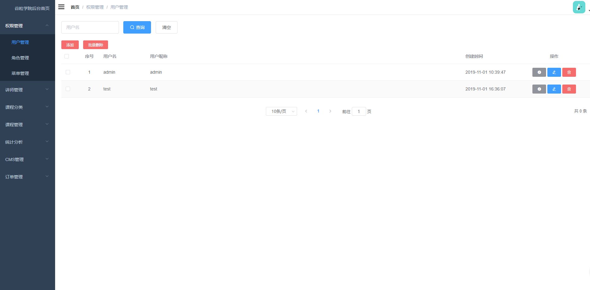
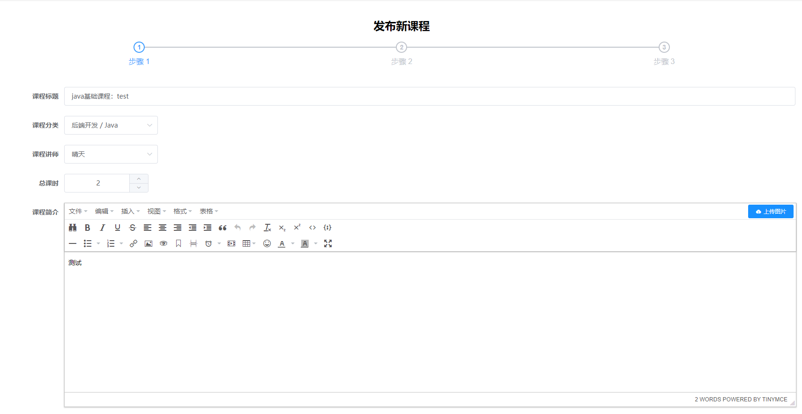
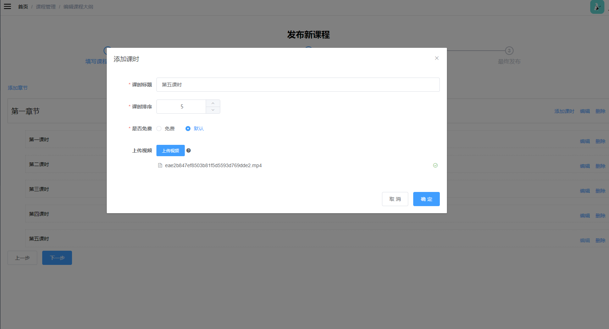
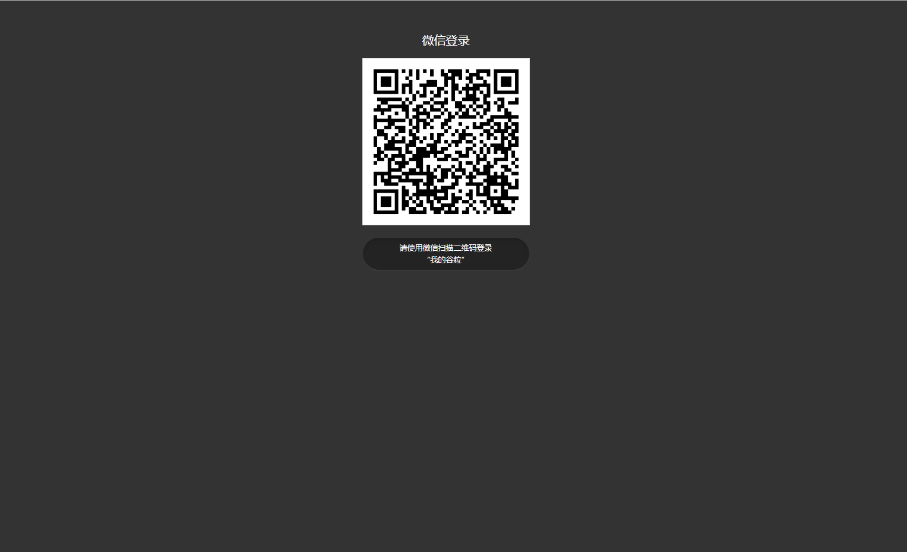
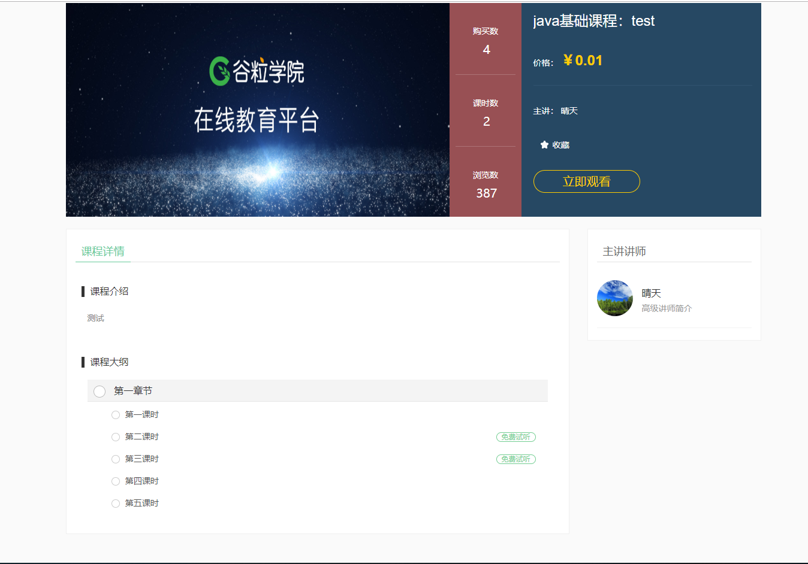

# gl_edu
在线教育后端
##项目介绍
在线教育系统，分为前台网站系统和后台运营平台，B2C模式。
前台用户系统包括课程、讲师、问答、文章几大大部分，使用了微服务技术架构，前后端分离开发。
后端的主要技术架构是：SpringBoot + SpringCloud + MyBatis-Plus + HttpClient + MySQL + Maven+EasyExcel+ nginx
前端的架构是：Node.js + Vue.js +element-ui+NUXT+ECharts

其他涉及到的中间件包括Redis、阿里云OSS、阿里云视频点播
业务中使用了ECharts做图表展示，使用EasyExcel完成分类批量添加、注册分布式单点登录使用了JWT


项目前后端分离开发，后端采用SpringCloud微服务架构，持久层用的是MyBatis-Plus，微服务分库设计，使用Swagger生成接口文档
接入了阿里云视频点播、阿里云OSS。
系统分为前台用户系统和后台管理系统两部分。
前台用户系统包括：首页、课程、名师、问答、文章。
后台管理系统包括：讲师管理、课程分类管理、课程管理、统计分析、Banner管理、订单管理、权限管理等功能

##模块划分
```
service_acl: 鉴权服务
service_cms: 轮播条管理服务
service_edu: 讲师课程服务
service_order: 订单服务
service_oss: 对象存储服务
service_sms: 短信服务
service_statistics : 统计服务
service_ucenter: 会员服务
service_vod :视频点播服务
api_gateway: 网关服务

canal_client:数据同步工具demo
```

##项目截图










